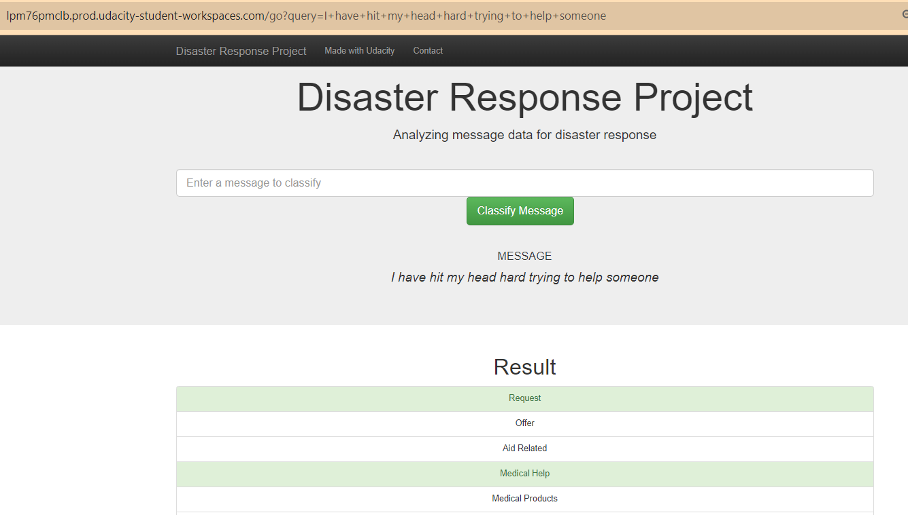

# Disaster Response Pipeline

## Summary

This is project 2 of the Udacity Data Scientist Nanodegree term 2, which takes messages received during disasters which have been classified into different topics. This data is used to build an app which both displays the data, as well as train a machine learning model which can be used to classify new messages added by the user into the web application.

Using a machine learning model to predict classifications should lead to better results that searching messages for key terms, which may miss messages conveying the same sentiment the user is looking for.

This project has three components:

 1) An ETL pipeline that reads in messages and associated categories from disasters that can be used to train models.
    The data is loaded and cleaned ready for 2)

2) An ML pipeline that uses grid search to find the best parameters for a RandomForestClassifier, to predict
    the categories from the message

3) A web app that displays some key visualisations of the training data (see figure 1)
    as well as the ability to classify new messages (see figure 2)

### Figure 1 - App home screen showing visualtions on the training data


### Figure 2 - Ability of app to classify new messages entered by the user


### Files in the repository:
```
├── app/
│   ├── run.py
│   └── templates/
│       ├── go.html
│       └── master.html
├── data/
│   ├── disaster_categories.csv
│   ├── disaster_messages.csv
│   ├── DisasterResponse.db
│   └── process_data.py
├── models/
│   ├── classifier.pkl
│   ├── classifier_old.pkl
│   └── train_classifier.py
├── notebooks/
│   ├── DisasterMessagesDatabase.db
│   ├── ETL Pipeline Preparation.ipynb
│   └── ML Pipeline Preparation.ipynb
├── poetry.lock
├── poetry.toml
├── pyproject.toml
├── README.md
└── resources/
    ├── home_screen.png
    └── msg_classification.png
```

### Instructions:
1. Run the following commands in the project's root directory to set up your database and model.

    - To run ETL pipeline that cleans data and stores in database
        `python data/process_data.py data/disaster_messages.csv data/disaster_categories.csv data/DisasterResponse.db`
    - To run ML pipeline that trains classifier and saves
        `python models/train_classifier.py data/DisasterResponse.db models/classifier.pkl`

2. Run the following command in the app's directory to run your web app.
    `python run.py`

3. Go to http://0.0.0.0:3000/
